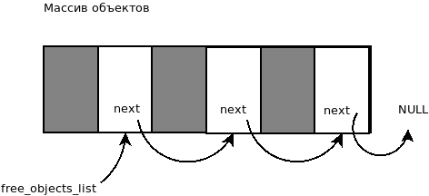
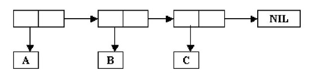
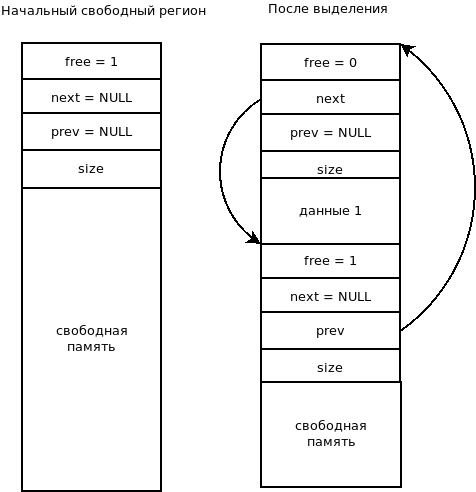

Реализация интерпретатора
=========================

Лексический анализатор (lexer.c)
--------------------------------

Лексический анализатор пропускает пустоты (пробелы, переводы строк) и выполняет распознавание лексем:

* целое число: 10;
* символ: A;
* цитата: '
* обратная кавычка: `
* запятая: ,
* запятая-at: ,@
* решетка: #
* левая скобка: (;
* правая скобка: );
* строка: "a b c v ddd";
* конец потока.

Символ начинается с буквы или разрешенного символа, может в себе содержать буквы, цифры, символы.

Синтаксический анализатор (parser.c)
------------------------------------

Синтаксический анализатор преобразовывает информацию из лексем и создает объекты соответствующего типа.

Представление объектов (objects.c)
----------------------------------

Каждый объект имеет тип и данные (в зависимости от типа).

Типы объектов:

* символ;
* целое число;
* пара (для представления списков);
* строка;
* массив объектов.

Для символа и пары хранится указатель на соответствующую структуру, для целого числа хранится само число.

Объекты распределяются из пула (фиксированного массива) по мере надобности.

Для освобождения памяти используется список свободных объектов:

Переменная free_objects_list указывает на начало списка свободных объектов (изначально пустой). В структуре объекта поле next указывает на следующий свободный объект. При освобождении объекта, данный объект добавляется в начало списка свободных объектов.

При создании объекта сначала берется объект по счетчику (от 0 до максимума объектов). Когда счетчик достигает максимального числа объектов, то объект берется из головы списка свободных объектов (при этом он должен быть удален из этого списка).

Для того, чтобы исключить повторное освобождение объектов и пар, в структуру добавлено поле, которое обозначает свободный ли этот объект или нет.
и
Пары выделяются и освобождаются аналогично.

Представление символов (symbols.c)
----------------------------------

Символы хранятся в своих структурах, где есть поле - строка (массив символов). Каждый символ должен храниться в единичном экземпляре. Это можно обеспечить с помощью хеш таблицы. Для строки символа вычисляется хеш-значение, которое используется как индекс в хеш-таблице.

Представление списков
---------------------

Списки выражений представлены парой объектов. Пара состоит из двух объектов (car и cdr). Объект car - это голова списка (первый элемент). Объект cdr - это пара, которая продолжает список (хвост списка).

Список (A B C) представляется следующим образом:

Представление массивов и строк
------------------------------

Данные массивов (указатели на объекты) и строк (символы + 0) хранятся в специальной памяти регионов (массив байт фиксированной длины). Регионы организованы в двунаправленный список. Каждый регион может быть или свобоным или занятым, но не может быть последовательно идущих свободных регионов (они объединяются при освобождении).

Изначально существует один свободный регион, из которого выделяются области памяти.

Реализация примитивов
---------------------

Каждый примитив должен быть зарегистрирован как символ (имя функции), который имеет ссылку на функцию реализации примитива. Для этого в структуре символа есть поле func.

Реализация функций
------------------

Лямбда функции - это объект (lambda (p1 ... pn) выражение). При выполнении (применении к аргументам) функции необходимо создать окружение. Окружение - это ассоциативный массив, где параметрам соответствуют вычисленные значения аргументов:
::
   
   (p1 z1) (p2 z2) ... (pn zn)

Используя это окружение, можно выполнять подстановку, вместо параметра подставляется его значение.

Вновь созданные функции представляются как лямбда функции и хранятся как значения символа (имени функции).

Функция eval:
::

   object_t *eval(object_t *obj, object_t *env)
   obj - объект, который вычисляем
   env - текущее окружение (в начале NULL)

В функции eval нам нужно вычислять выражения типа
::
   
   ((labmda (x) x) 1)
то есть на первом месте стоит лямбда.

Cсоответственно в eval мы должны проверять первый элемент списка, что это корректная lambda функция,это функция:
::

   int is_lambda(object_t *obj)
   
остается только:
::
   
   eval_func(object_t *lambda, object_t *args)
   
мы ее вызываем, передаем lambda объект и вычисленные аргументы (уже есть функция вычисляющая аргументы).
эта функция должна строить окружение, дополнительная функция:
::

   object_t * make_env(object_t *args, object_t *values)
   
   args - список аргументов (x y)
   values - список значений (1 2)
   
   возвращает окружение ((X 1) (Y 2))
   
Далее нужно вызвать eval с созданным окружением и телом функции. Новое окружение должно быть добавлено впереди текущего (кадр стека). Например было окружение:
::

   ((X 1))

Вызывается еще раз функция с параметром X = 2, получается окружение:
::

   ((X 2) (X 1))

В eval если встречается символ, то он ищется в окружении, если нет, то ошибка - неизвестный символ.
Если символ найден, то берется его значение из окружения.
Дополнительная функция:
::
   
   int find_in_env(object_t *env, object_t *sym, object_t **res)
   env - окружение где ищем,
   sym - символ, который ищем
   res - сюда записывается результат поиска
   возвращаемое значение - 1 - найдено, 0 - нет

Сборка мусора
-------------

Объекты и пары должны освобождаться в определенные моменты времени: в конце вычисления выражения верхнего уровня. Символы не очищаются никогда. Для сборки мусорка используем алгоритм пометки и очистки.

Фаза пометки
^^^^^^^^^^^^

Обходим все занятые символы в таблице символов. Выполняем пометку объектов на которые указывают символы (поле value). Пометка - это дополнительное поле mark в структуре объекта и пары. Если помечается объект-пара, то нужно также рекурсивно пометить левый и правый объект этой пары.

Фаза очистки
^^^^^^^^^^^^

Обходим все выделенные объекты и пары. Если есть пометка, то пометку снимаем. Если нет - то объект и/или пара освобождается.
