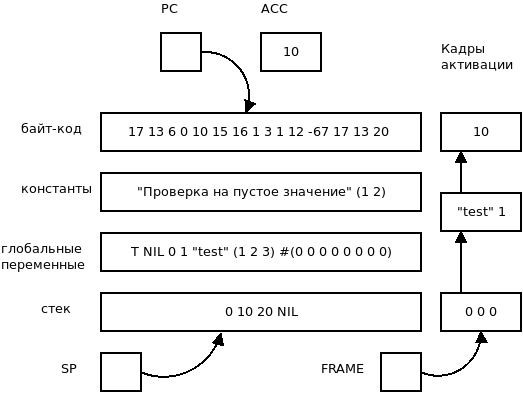
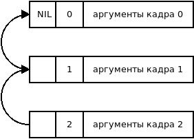

Компилятор Lisp
==============================

Фаза 1 - Статический анализ и компиляция исходного дерева
---------------------------------------------------------

Исходное S-выражение преобразуется в другое S-выражение, состоящее из простых операций.

Константы остаются без изменений.

Для переменных вычисляется лексическое окружение в момент обращения к ним. В результирующей программе вместо окружений будут создаваться записи активаций. Окружение состоит из кадров, в каждом находится список связанных лексических переменных. Новый кадр создается только при вызове функции, предыдущее окружение восстанавливается после выхода из функции, начальное лексическое окружение пустое.

Глобальные переменные создаются при присваивании и сохраняются с списке \*global-variables\*.

При компиляции переменных определяется тип переменной: локальная, глобальная, свободная. Для локальных переменных вычисляется смещение в текущем кадре, для глобальных - индекс в списке глобальных переменных. Для свободных переменных вычисляются два смещения - смещение на кадр, где расположена свободная переменная, относительно текущего кадра, и смещение внутри кадра. Таким образом в результате компиляции все переменные статически разрешаются, при выполнении не будет их поиска.

Последовательности выражений (progn) компилируются в древовидную последовательность, для одиночных выражений progn убирается.

В условной форме if анализируются и компилируются все три аргумента, результаты передаются в форму ALTER.

При компиляции присваиваний также как и при обращении к переменным определяется тип переменной и компилируются выражения для присваивания.

Пользовательские функции с фиксированным числом аргументов компилируются также как и лямбда-функции, в глобальную таблицу функций \*fix-functions\* сохраняются имена функций, смещение кадра окружения, в котором определяется функция, число их аргументов, которое используется для проверки при применении функции. Для лямбда функций имена генерируются.

Функции с переменным числом аргументов сохраняются в таблицу \*nary-functions\*, где хранятся имена функций, смещение кадра окружения и число фиксированных аргументов (остальные аргументы будут в добавленном списке).

При компиляции формы labels, расширяется окружение локальных функций, где сохраняется локальное имя функции и сгенерированное имя функции, затем генерируется код функций, после чего окружение возвращается к предыдущему состоянию.

Примитивы с фиксированным числом аргументов хранятся в таблице \*fix-primitives\*, хранится имя примитива и число аргументов.

Примитивы с переменным числом аргументов хранятся в таблице \*nary-primitives\*, хранится имя примитива и число фиксированных аргументов.

При компиляции применения функции, определяется тип функции: глобальная, лямбда или примитив. Происходит проверка числа аргументов. Для лямбда функций перед вызовом вставляется скомпилированное тело функции. Перед вызовом функции активируется замкнутое окружение функции, создается кадр активации с заранее вычисленным размером, вычисляются слева направо аргументы, и заносятся в текущий кадр. При вызове примитивов кадр активации не создается.

Компиляция tagbody. Список выражений преобразуется в SEQ.
Символы в теле преобразуются в:
::

   (LABEL <метка> (NOP))

 go преобразуется в GOTO. Остальные выражения компилируются.

Компиляция CATCH/THROW
^^^^^^^^^^^^^^^^^^^^^^

Компилятор генерирует метку для конца блока catch, куда будет передано управление в случае throw. Команда catch берет метку из acc, добавляет ее в стек catch вместе с абослютным адресом места перехода, номером текущего кадра активации и указателем стека. Команда throw позразумевает, что метка находится на вершине стека, а значение, которое нужно вернуть в acc. Она ищет ближайшую запись таблицы с именем метки (если не найдено - ошибка), восстанавливает кадр активации, стек и делает переход на сохраненную позицию.
::
   
   (defun test1 (x)
      (throw 'test x))

   (catch 'test
     (test1 10))

    компилируется в
     
    (LABEL test1)
    <компиляция тега>    
    (CONST TEST)
    (PUSH)
    <компиляция значения throw>
    (LOCAL-REF 0) ; значение в аккумуляторе
    (THROW) ; берет метку из стека
     ; восстановление стека (номер кадра из таблицы меток)
     ; переход на метку catch
    (RETURN)

    (CONST TEST)
    (CATCH catch-test) ; метка catch из аккумулятора, метка перехода сохраняется
    (CONST 10)
    (PUSH)
    (ALLOC 1)
    (REG-CALL test1)
    (LABEL catch-test)

Операции после первой фазы:

:CONST expr: Выражение константа.
:LOCAL-REF j: Обращение к j-той локальной переменной.
:GLOBAL-REF i: Обращение к i-той глобальной переменной.
:DEEP-REF i j: Обращение к дальней свободной переменной.
	       i - смещение кадра активации, j - позиция в кадре.
:SEQ <expr list>: Последовательность вычислений списка выражений.
:ALTER cond true false: Условный оператор с выражениями условия, истины и лжи.
:LOCAL-SET j expr: Присваивание выражения в j-тую локальную переменную.
:GLOBAL-SET i expr: Присваивание выражения в i-тую глобальную переменную.
:DEEP-SET i j expr: Присваивание выражения в дальнюю свободную переменную.
	       i - смещение кадра активации, j - позиция в кадре.
:LABEL lab expr: Выражение с меткой. Выражение может быть пустым.
:FIX-LET num args expr: let форма, num - число аргументов, args - список выражений аргументов, expr - тело lambda
:FIX-CLOSURE name body: Замыкание функции (фиксированное число аргументов) с именем name и телом body.
:PRIM-CLOSURE name: Замыкание примитива (фиксированное число аргументов) с именем name.
:NPRIM-CLOSURE name: Замыкание примитива (переменное число аргументов) с именем name.
:RETURN: Выход из функции.
:FIX-CALL name env args: Вызов функции с именем name, номером окружения ofs и списком выражений аргументов args (фиксированное число аргументов).
:NARY-CALL name num env args: Вызов функции с именем name, номером окружения ofs и списком выражений аргументов args (переменное число аргументов).
			      num - число фиксированных аргументов.
:FIX-PRIM name args: Вызов примитива (фиксированное число аргументов) с именем name и списком выражений аргументов args.
:NARY-PRIM name num args: Вызов примитива (переменное число аргументов) с именем name, числом фиксированных аргументов num и списком выражений аргументов args.
:NOP: Нет операции
:GOTO lab: Переход на метку.
:CATCH tag_exp body_expr: Блок catch с выражением метки tag_expr и множеством выражений body_expr.
:THROW tag_expr ret_expr: Выход из блока catch с выражением метки tag_expr и результатом вычислений ret_expr.

Фаза 2 - Оптимизация преобразованного выражения
-----------------------------------------------

Оптимизация загрузки регистра аккумулятора
^^^^^^^^^^^^^^^^^^^^^^^^^^^^^^^^^^^^^^^^^^

Если встречается последовательность команд загрузки данных в регистр аккумулятора, то все эти операции, кроме последней удаляются (заменяются на NOP).
::

   (SEQ (<команда загрузки 1> ...) ... (<команда загрузки n> ...) ... )
                    |
		    V
   (SEQ (NOP) ... (<команда загрузки n> ...) ...)
   <команда загрузки> ::= CONST | LOCAL-REF | GLOBAL-REF | DEEP-REF

Если встречается *-REF после *-SET с той же переменной, то *-REF удалить.
   
Оптимизация тривиальных условий
^^^^^^^^^^^^^^^^^^^^^^^^^^^^^^^

Условный оператор, где условие - константы истина или ложь можно упростить:
::

   (ALTER (CONST T) expr1 expr2) -> expr1
   (ALTER (CONST NIL) expr1 expr2) -> expr2

      
Фаза 3 - Генерация линейных инструкций
--------------------------------------

Дерево, полученное на этапе компиляции, преобразуетс в ассемблер код - список инструкций с мнемониками вместо опкодов. Для этого элементы дерева, начиная с самого верхнего, рекурсивно генерируются определённым образом.

Инструкции после генерации:

:CONST val: Записать val в аккумулятор.
:LOCAL-REF j: Записать j-тую локальную переменную в аккумулятор.
:GLOBAL-REF i: Записать i-тую глобальную переменную в аккумулятор.
:DEEP-REF i j: Записать дальнюю свободную переменную в аккумулятор.
	       i - смещение кадра активации, j - позиция в кадре.
:LOCAL-SET j: Записать значение аккумулятора в j-тую локальную переменную.
:GLOBAL-SET i: Записать значение аккумулятора в i-тую глобальную переменную.
:DEEP-SET i j: Записать значение аккумулятора в дальнюю свободную переменную.
	       i - смещение кадра активации, j - позиция в кадре.
:PUSH i: Помещаем аккумулятор в стек, i - игнорируется.
:POP: Извлекаем значение из стека и записываем в аккумулятор.
:LABEL name: Символьная метка.
:JMP label: Безусловный переход на метку.
:JNT label: Переход на метку если в аккумуляторе nil.
:ALLOC n: Создать новый кадр активации с размером n.
	  Записать туда значения из стека в обратном порядке.
:PRIM name: Вызов примитива с именем name.
:PACK n: Упаковка n верхних элементов в стеке в список.
	 Если n равен 0, то добавляет пустой список в стек.
:REG-CALL name: Вызов функции с меткой name.
:SAVE-ENV: Сохранить текущий кадр активации в стеке.
:SET-ENV num: Установить кадр активации с позицией num от начала списка кадров.
:RESTORE-ENV: Восстановить кадр активации из стека.
:FIX-CLOSURE name: Создать замыкание с текущим кадром активации,
		   кодом по метке name, записать замыкание в аккумулятор.
:PRIM-CLOSURE name: Создать замыкание с текущим кадром активации,
		     именем примитива name (фиксированное число аргументов), записать замыкание в аккумулятор.
:NPRIM-CLOSURE name: Создать замыкание с текущим кадром активации,
		     именем примитива name (переменное число аргументов), записать замыкание в аккумулятор.
:RETURN: Выход из функции.
:CATCH ofs: Создать блок catch, метка блока в acc, конец блока по смещению ofs.
:THROW: Нелокальный переход на конец блока catch с меткой на вершине стека и результатом вычисления в acc.

Для элементов CONST, GLOBAL-REF, LOCAL-REF, DEEP-REF и RETURN существуют соответствующие инструкции, поэтому они генерируются как инструкции с мнемониками и операндами без изменений.

Для элементов GLOBAL-SET, LOCAL-SET и DEEP-SET сначала генерируется вычисление их аргументов, при этом идёт симуляция глобальных переменных и окружения, чтобы затем эти инструкции можно было сгенерировать с правильными аргументами.

Элемент LABEL используется для генерации тела функции, поэтому сначала рассчитывается метка после тела функции, генерируется переход на эту метку, после этого генерируется тело самой функции, и в конце добавляется эта метка.

В элементе SEQ для каждого дочернего элемента рекурсивно по очереди происходит дальнейшая генерация.

Для элемента ALTER рассчитываются метки для ветки по лжи и для конца if-блока, затем генерируется условие, условный переход на ветку по лжи, тело по истине и безусловный переход на конец блока, метка и тело по лжи, и метка конца блока.

В элементе FIX-PRIM для каждого аргумента генерируется вычисление этого аргумента и инструкция PUSH, затем генерируется вызов соответствующего примитива PRIM.

В элементе NARY-PRIM для каждого аргумента генерируется вычисление этого аргумента и инструкция PUSH, необязательные аргументы собираются в список с помощью команды PACK (удаляются из стека и добавляются как список), затем генерируется вызов соответствующего примитива PRIM.

Для элемента REG-CALL генерируется установление соответствующего окружения для текущей функции (SET-ENV), создание кадра активации (ALLOC), генерация вычисления и добавления в окружение аргументов функции, вызов самой функции (REG-CALL) и в конце восстановление окружения (RESTORE-ENV).

Фаза 4 - Ассемблер.
-------------------

Последним шагом компиляции является генерация байт-кода из ассемблер-кода. Ассемблирование происходит в 2 прохода.

При первом проходе мнемоники опкодов заменяются соответствующими байтами опкодов, при этом если встречается метка, то она не добавляется в результирующий байт-код, но запоминается в хеш-таблицу c адресом следующей инструкции, и если встречается инструкция перехода, то в отдельный список добавляется текущий адрес с меткой, которую использует данная инструкция.

Второй проход идёт по списку адресов с метками и в байт-коде заменяется соответствующие метки на адреса меток из хеш-таблицы.

На выходе компилятора:

* список констант;
* число глобальных переменных;
* массив с байт-кодом.

Точку входа в программу можно посчитать (перейти по всем JMP, до первого оператора не JMP).

Виртуальная машина
------------------------------

Точка входа виртуальной машины - функция vm-run:

::

  (vm-run program)
    program - байт-код (массив инструкций).

В байт-коде каждый байт - опкод или операнд инструкции.

Функция последовательно выполняет инструкции и возвращает значение регистра ACC в результате выполнения байт-кода.

Архитектура виртуальной машины
^^^^^^^^^^^^^^^^^^^^^^^^^^^^^^

Машина включает в себя память программы (где хранится байт код программы), память констант, память глобальных переменных, стек, список кадров активации и регистры.

	   
В памяти программы хранятся инструкции программы в виде объектов NUMBER. Каждая команда состоит из кода операции и возможных параметров.

В памяти констант и глобальных переменных могут храниться объекты любых типов.

Стек может хранить объекты любых типов.

Кадры активации представляют собой объекты-массивы.

Первый элемент массива -- это ссылка на предыдущий кадр. Следующий элемент служит для ускорения поиска кадра по глубине вызова, здесь хранится номер кадра (глубина вызовов). Остальные элементы массива -- это локальные аргументы. Кадры могут иметь не только линейную, но и древовидную структуру, поэтому необходима ссылка на предыдущий кадр. Такие объекты удобно записывать в стек, восстанавливать из стека. Кадры активации создаются динамически как и другие объекты программы.

Для блоков catch существует отдельный стек, который хранит записи из имени метки, абсолютного адреса конца блока, номера кадра активации, указателя стека.

Регистры машины:

:PC: хранит адрес текущей выполняемой инструкции из памяти программы.
:ACC: хранит результат последней операции. Может быть любым объектом.
:FRAME: текущий кадр активации.
:SP: указатель стека.
:CATCH-SP: указатель стека для catch.

Сборка мусора включает в себя фазу пометки и фазу очистки. В фазе пометки помечаются объекты, до которых можно дойти с помощью обхода, начиная с корневых объектов в регистрах. Это регистр аккумулятора ACC, указатель на текущий кадр активации FRAME, все объекты находящиеся в стеке, начиная с текущей позиции SP, а также все объекты в памяти констант и глобальных переменных.
	   
Список инструкций:
	   
:Код  Имя:            Описание
:0    CONST num:      поместить константу с номером num в регистр ACC.
:1    JMP ofs:        безусловный переход на смещение ofs относительно PC.
:2    JNT ofs:        если ACC == NIL, то относительный переход на смещение ofs.
:3    ALLOC n:        создать новый кадр активации с числом аргументов n.
                      извлечь из стека аргументы начиная с позиции 1
		      (0-й элемент остается в стеке)
:4    GLOBAL-REF i:   устанавливает регистру ACC значение глобальной переменной с
                      индексом i.
:5    GLOBAL-SET i:   устанавливает глобальной переменной с индексом i значение
                      регистра ACC.
:6    LOCAL-REF i:    загружает в ACC значение i локальной переменной
                      (текущего кадра активации).
:7    LOCAL-SET i:    присваивает локальной переменной i (текущего кадра активации)
                      значение регистра ACC.
:8    DEEP-REF i j:   загружает в ACC значение локальной переменной с индексом j
                      в кадре i (начиная от текущего).
:9    DEEP-SET i j:   присваивает локальной переменной j в кадре i значение
                      регистра ACC.
:10   PUSH:           добавляет значение регистра ACC в стэк.
:11   PACK n:         собирает последние n элементов из стека в список и добавляет
                      его в стек.
:12   REG-CALL ofs:   добавляет адрес следующей инструкции в стэк и производит
                      переход по смещению ofs.
:13   RETURN:         производит переход на адрес из верхушки стэка, при этом
                      удаляет этот адрес из стэка.
:14   FIX-CLOSURE ofs:  в регистр ACC добавляется объект замыкание с текущим
                      кадром активации и смещением на код функции относительно текущего
		      адреса ofs.
:15   SAVE-FRAME:     сохраняет кадр активации в стеке
:16   SET-FRAME num:  устанавливает кадр активации с номером num
                      относительно начала глубины вызовов.
:17   RESTORE-FRAME:  восстанавливает кадр активации из стека.
:18   PRIM n:         вызывает примитив с номером n из таблицы примитивов с
                      фиксированным числом аргументов.
:19   NPRIM n:        вызывает примитив с номером n из таблицы примитивов с
                      переменным числом аргументов.
:20   HALT:           останов машины
:21   PRIM-CLOSURE n:  в регистр ACC добавляется объект замыкание с текущим
                        кадром активации и адресом кода примитива с фиксированным числом аргументов и номером n.
:22   NPRIM-CLOSURE n:  в регистр ACC добавляется объект замыкание с текущим
                        кадром активации и адресом кода примитива с переменным числом аргументов и номером n.
:23   CATCH ofs:      добавляет запись в стек catch, сохраняется имя метки в acc, абсолютный адрес по смещению ofs, текущий кадр активации, укзатель стека.
:24   THROW:          извлекает из стека имя метки блока catch, ищет в стеке catch запись с этим именем (если не найдена - ошибка), восстанавливает кадр активации, указатель стека, выполяет переход на сохраненный адрес конца блока catch, отбрасывает все кадры стека catch выше найденного (включая его самого).
